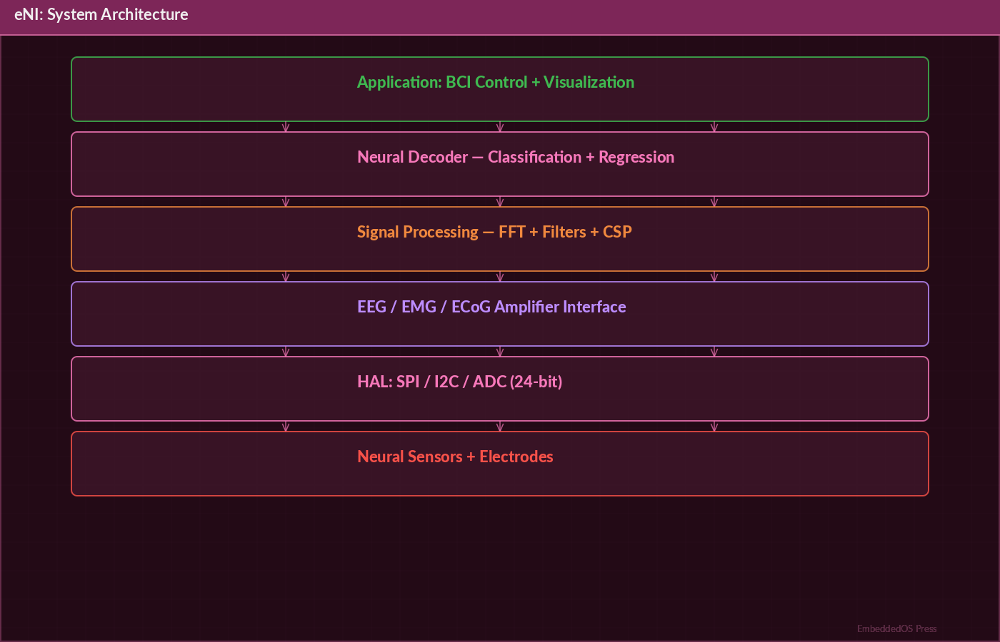
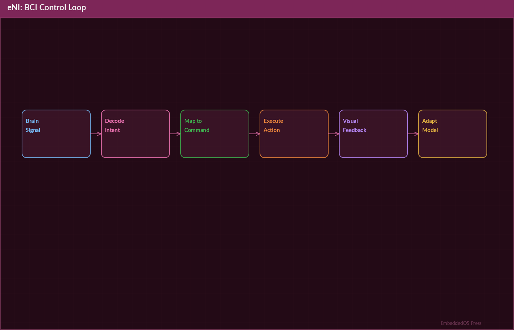
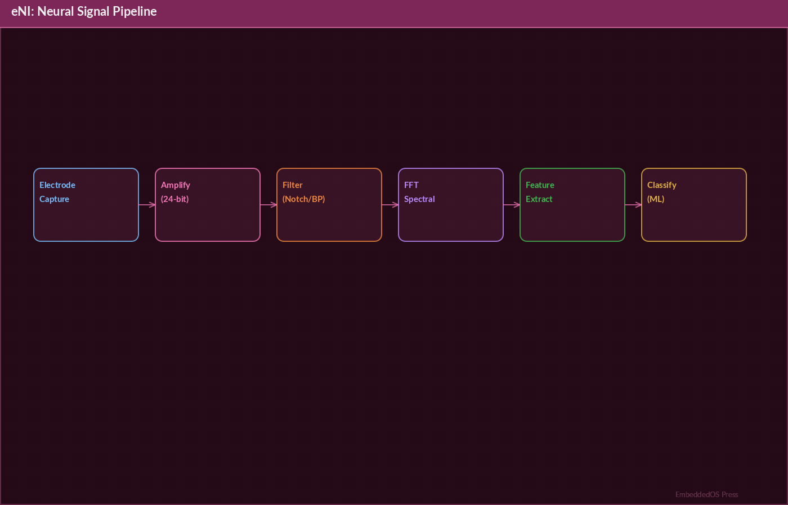

---

# ENI — Embedded Neural Interface

## The Definitive Technical Reference




**Version 1.0**

**Srikanth Patchava & EmbeddedOS Contributors**

**April 2026**

---

*Published as part of the EmbeddedOS Product Reference Series*

*MIT License — Copyright (c) 2026 EmbeddedOS Organization*

---

# Preface

The Embedded Neural Interface (ENI) represents one of the most ambitious subsystems in the EmbeddedOS ecosystem: a standardized, vendor-neutral framework for integrating brain-computer interfaces (BCI [@wolpaw2012]), neural decod [@georgopoulos1986]ers, and assistive input systems into the EoS embedded operating system platform.

This reference book is intended for firmware engineers, neurotechnology researchers, BCI application developers, and systems architects who need to understand, configure, extend, or deploy the ENI framework. Whether you are connecting a Neuralink [@neuralink2019] N1 implant, building an EEG [@sanei2013]-based assistive device, or simulating neural signals for test automation, this book provides the comprehensive technical depth required for production-grade work.

ENI bridges the gap between cutting-edge neurotechnology hardware and deterministic, safety-critical embedded systems. It provides real-time signal acquisition from devices with up to 1024 channels at 30 kHz, a full digital signal processing pipeline, lightweight neural network inference, intent decoding, neurofeedback loops, and integration with the broader EoS AI and IPC subsystems.

The framework is organized into three tiers:

- **ENI-Min** — A minimal runtime for resource-constrained MCU targets, providing signal filtering, normalization, event mapping, and a tool bridge with minimal RAM footprint.
- **ENI-Framework** — The full-featured framework for application processors, including connectors, pipeline orchestration, advanced DSP, and neural network inference.
- **Provider Layer** — Hardware-specific adapters (Neuralink, EEG, simulator, stimulator) implementing the `eni_provider_ops_t` interface.

This book covers the complete ENI system: architecture, APIs, DSP pipeline, neural network inference, provider development, EIPC integration, safety systems, testing, and deployment.

We hope this reference empowers you to build the next generation of neural-enabled embedded systems.

— *Srikanth Patchava & EmbeddedOS Contributors, April 2026*

---

# Table of Contents

1. [Introduction](#chapter-1-introduction)
2. [Getting Started](#chapter-2-getting-started)
3. [System Architecture](#chapter-3-system-architecture)
4. [Provider Framework](#chapter-4-provider-framework)
5. [Neuralink Provider](#chapter-5-neuralink-provider)
6. [EEG Provider](#chapter-6-eeg-provider)
7. [Simulator & Stimulator Providers](#chapter-7-simulator--stimulator-providers)
8. [Digital Signal Processing Pipeline](#chapter-8-digital-signal-processing-pipeline)
9. [Neural Network Inference](#chapter-9-neural-network-inference)
10. [Intent Decoding](#chapter-10-intent-decoding)
11. [Neurofeedback & Stimulation](#chapter-11-neurofeedback--stimulation)
12. [Safety Systems](#chapter-12-safety-systems)
13. [EIPC Integration & EAI Bridge](#chapter-13-eipc-integration--eai-bridge)
14. [ENI-Min: Minimal Runtime](#chapter-14-eni-min-minimal-runtime)
15. [ENI-Framework: Full Runtime](#chapter-15-eni-framework-full-runtime)
16. [Configuration Reference](#chapter-16-configuration-reference)
17. [API Reference](#chapter-17-api-reference)
18. [Build System & Cross-Compilation](#chapter-18-build-system--cross-compilation)
19. [Testing](#chapter-19-testing)
20. [CI/CD Pipeline](#chapter-20-cicd-pipeline)
21. [Troubleshooting](#chapter-21-troubleshooting)
22. [Glossary](#chapter-22-glossary)

---

# Chapter 1: Introduction

## 1.1 What is ENI?

ENI (Embedded Neural Interface) is a real-time neural, BCI, and assistive-input integration layer for the EoS embedded operating system. It provides a standardized, vendor-neutral framework to integrate brain-computer interfaces, neural decoders, and assistive input systems into embedded platforms.




The framework handles the complete pipeline from raw neural signal acquisition through digital signal processing, feature extraction, neural network inference, intent decoding, and actuation — all within the deterministic timing constraints required by embedded and safety-critical systems.

## 1.2 Key Capabilities

| Capability | Description |
|---|---|
| Multi-provider support | Neuralink (1024ch, 30 kHz), EEG headsets, simulators, custom hardware |
| Real-time DSP | FIR/IIR filtering, FFT, Welch PSD, band power extraction |
| Neural inference | Lightweight dense-layer networks with ReLU/softmax activation |
| Intent decoding | Feature extraction, classification, confidence scoring |
| Neurofeedback | Haptic, visual, and audio feedback for closed-loop BCI training |
| Stimulation | Waveform generation with charge balancing and safety interlocks |
| EIPC bridge | Neural intents routed to EAI agent via IPC for AI tool calls |
| Dual runtime | ENI-Min for MCU targets, ENI-Framework for application processors |
| Cross-platform | Linux, Windows, macOS, ARM cross-compilation |

## 1.3 Design Philosophy

ENI follows several core design principles:

1. **Vendor neutrality** — Hardware-specific code is isolated behind the `eni_provider_ops_t` interface. Adding a new BCI device requires implementing three functions: `init`, `read`, and `deinit`.

2. **Safety first** — Stimulation output includes charge limits, impedance checks, and emergency stop. The safety subsystem enforces hard limits regardless of application-level requests.

3. **Deterministic timing** — The DSP pipeline operates on fixed-size buffers with bounded execution time, suitable for real-time operating systems.

4. **Minimal footprint** — ENI-Min provides essential BCI functionality in under 32 KB of RAM, enabling deployment on Cortex-M0+ and similar constrained targets.

5. **Composability** — ENI integrates with the broader EoS ecosystem through EIPC, allowing neural intents to drive AI agent actions, system services, and application workflows.

## 1.4 Use Cases

- **Assistive technology** — Controlling embedded devices via neural signals for users with motor disabilities
- **Neuroprosthetics** — Decoding motor intent for prosthetic limb control
- **BCI research** — Rapid prototyping of neural decoding algorithms on embedded hardware
- **Neurofeedback therapy** — Closed-loop systems for attention training, meditation, and rehabilitation
- **Human-machine teaming** — Augmenting operator capabilities in industrial and defense applications

---

# Chapter 2: Getting Started

## 2.1 Prerequisites

- **C compiler**: GCC 10+ or Clang 14+ (C11 support required)
- **CMake**: Version 3.16 or later
- **Platform**: Linux (primary), Windows (MSVC/MinGW), macOS
- **Optional**: ARM cross-compiler (`aarch64-linux-gnu-gcc`) for embedded targets

## 2.2 Cloning the Repository

```bash
git clone https://github.com/embeddedos-org/eni.git
cd eni
```

## 2.3 Building ENI

### Full Build (Minimal + Framework + Neuralink)

```bash
cmake -B build -DENI_BUILD_TESTS=ON
cmake --build build
```

### Minimal Only (MCU Targets)

```bash
cmake -B build -DENI_BUILD_MIN=ON -DENI_BUILD_FRAMEWORK=OFF
cmake --build build
```

### Without Neuralink Provider

```bash
cmake -B build -DENI_PROVIDER_NEURALINK=OFF
cmake --build build
```

### With EIPC Integration

```bash
cmake -B build -DENI_EIPC_ENABLED=ON
cmake --build build
```

### Cross-Compile for ARM

```bash
cmake -B build-arm \
  -DCMAKE_C_COMPILER=aarch64-linux-gnu-gcc \
  -DCMAKE_SYSTEM_NAME=Linux
cmake --build build-arm
```

## 2.4 Running Tests

```bash
ctest --test-dir build --output-on-failure
```

## 2.5 First Application

The following minimal example demonstrates the core ENI workflow — initializing a provider, reading neural data, and decoding an intent:

```c
#include "eni/event.h"
#include "eni/config.h"
#include "eni/decoder.h"

int main(void) {
    // Initialize the ENI subsystem
    eni_config_t cfg = eni_config_default();
    cfg.provider = "simulator";
    cfg.channels = 8;
    cfg.sample_rate = 256;
    eni_init(&cfg);

    // Start data acquisition
    eni_start();

    // Main processing loop
    while (eni_running()) {
        eni_sample_t samples[8];
        int n = eni_read(samples, 8);

        if (n > 0) {
            eni_intent_t intent;
            eni_decode(samples, n, &intent);

            if (intent.confidence > 0.85f) {
                printf("Intent: %s (%.2f%%)\n",
                       intent.label, intent.confidence * 100.0f);
            }
        }
    }

    eni_shutdown();
    return 0;
}
```

---

# Chapter 3: System Architecture

## 3.1 Architectural Overview

ENI is organized as a layered system with clear separation between hardware abstraction, signal processing, and application-level intent decoding.

```
┌──────────────────────────────────────────────────────────────┐
│                    ENI Neural Interface                       │
│                                                              │
│  ┌──────────────┐  ┌──────────────┐  ┌────────────────────┐ │
│  │   Neuralink   │  │  Simulator   │  │  Generic / Custom  │ │
│  │  1024ch 30kHz │  │  Test data   │  │  Vendor-agnostic   │ │
│  └──────┬───────┘  └──────┬───────┘  └──────┬─────────────┘ │
│         │                  │                  │               │
│  ┌──────▼──────────────────▼──────────────────▼───────────┐  │
│  │              Provider Framework                         │  │
│  │         eni_provider_ops_t (init/read/deinit)          │  │
│  └──────────────────────┬─────────────────────────────────┘  │
│                         │                                     │
│  ┌──────────────────────▼─────────────────────────────────┐  │
│  │              Common Layer                               │  │
│  │  Events · Policy · Config · Logging · EIPC Bridge       │  │
│  │  DSP · Neural Net · Decoder · Feedback · Stimulator     │  │
│  └──────────────────────┬─────────────────────────────────┘  │
│                         │                                     │
│  ┌─────────────┐  ┌────▼────────┐                            │
│  │  ENI-Min    │  │ENI-Framework│                            │
│  │  (MCU)      │  │ (App Proc)  │                            │
│  │  filter     │  │ connectors  │                            │
│  │  normalizer │  │ pipeline    │                            │
│  │  mapper     │  │ orchestrator│                            │
│  │  tool bridge│  │             │                            │
│  └─────────────┘  └─────────────┘                            │
│         │                  │                                  │
│  ┌──────▼──────────────────▼──────────────────────────────┐  │
│  │              EIPC Bridge → EAI Agent                    │  │
│  │         Neural intents → AI tool calls                  │  │
│  └────────────────────────────────────────────────────────┘  │
└──────────────────────────────────────────────────────────────┘
```

## 3.2 Layer Descriptions

### Provider Layer

The topmost layer contains hardware-specific adapters. Each provider implements the `eni_provider_ops_t` interface, abstracting the details of signal acquisition from specific BCI hardware. The framework ships with five providers:

| Provider | Description | Channels | Sample Rate |
|---|---|---|---|
| Neuralink | Neuralink N1 BCI adapter | 1024 | 30,000 Hz |
| EEG | Multi-channel EEG headset | 8–64 | 256–1024 Hz |
| Simulator | Test data generator | Configurable | Configurable |
| Stimulator Sim | Stimulation output simulator | N/A | N/A |
| Generic | Vendor-agnostic decoder | Configurable | Configurable |

### Common Layer

The common layer provides shared services used by both ENI-Min and ENI-Framework:

- **Events** — Neural event system for state changes, intent notifications, and error reporting
- **Config** — Runtime configuration management with profiles and dynamic tuning
- **DSP** — Digital signal processing including FIR/IIR filters, FFT, and spectral analysis
- **Neural Net** — Lightweight inference engine with dense layers and activation functions
- **Decoder** — Intent decoder combining feature extraction and classification
- **Feedback** — Neurofeedback subsystem for haptic, visual, and audio output
- **Stimulator** — Electrical stimulation with waveform generation and charge balancing
- **EIPC Bridge** — Integration with the EoS IPC framework for inter-process communication

### ENI-Min (MCU Runtime)

The minimal runtime targets resource-constrained microcontrollers (Cortex-M0+, Cortex-M4). It provides:

- Signal filtering and normalization
- Basic event mapping
- Tool bridge for simple command execution
- RAM footprint under 32 KB

### ENI-Framework (Application Processor Runtime)

The full framework targets application processors (Cortex-A, x86, RISC-V) and provides:

- Full pipeline orchestration
- Advanced connectors for multiple simultaneous providers
- ONNX model inference
- Complex intent decoding with multi-class classification

## 3.3 Data Flow

```
Hardware → Provider → Raw Samples → DSP Pipeline → Features → Neural Net → Intent → EIPC → EAI
                                        │
                                        ├── FIR/IIR Filter
                                        ├── FFT
                                        ├── Welch PSD
                                        ├── Band Power
                                        └── Feature Vector
```

1. **Acquisition** — The provider reads raw samples from BCI hardware
2. **Filtering** — FIR/IIR filters remove noise and artifacts
3. **Spectral analysis** — FFT and Welch PSD extract frequency-domain features
4. **Band power** — Power in delta, theta, alpha, beta, gamma bands is computed
5. **Feature extraction** — Statistical and spectral features form a feature vector
6. **Classification** — Neural network maps features to intent classes
7. **Decoding** — Intent decoder applies confidence thresholds and temporal smoothing
8. **Action** — Decoded intents are dispatched via EIPC to the EAI agent

## 3.4 Repository Structure

```
eni/
├── common/                   # Shared library
│   ├── include/eni/          #   Types, events, config, DSP, NN, decoder, feedback
│   └── src/                  #   Implementation
├── min/                      # Minimal runtime (MCU targets)
│   ├── include/eni_min/      #   Signal processor, decoder, feedback, service
│   └── src/                  #   Lightweight implementations
├── framework/                # Full framework (app processors)
│   ├── include/eni_fw/       #   Signal processor, decoder, feedback
│   └── src/                  #   Advanced implementations
├── providers/                # Hardware adapters
│   ├── neuralink/            #   Neuralink 1024-channel BCI
│   ├── eeg/                  #   EEG headset provider
│   ├── simulator/            #   Signal simulator
│   └── stimulator_sim/       #   Stimulation simulator
├── cli/                      # CLI tool (main.c)
├── tests/                    # Unit tests (8 test suites)
└── CMakeLists.txt            # Build configuration
```

---

# Chapter 4: Provider Framework

## 4.1 The Provider Interface

Every BCI hardware adapter in ENI implements the `eni_provider_ops_t` interface. This is the fundamental abstraction that enables vendor neutrality.

```c
typedef struct {
    const char *name;
    int  (*init)(void *ctx);
    int  (*read)(void *ctx, void *buf, int len);
    void (*deinit)(void *ctx);
} eni_provider_ops_t;
```

### Interface Methods

| Method | Signature | Description |
|---|---|---|
| `init` | `int init(void *ctx)` | Initialize the provider. Returns 0 on success, negative on error. The `ctx` pointer carries provider-specific configuration. |
| `read` | `int read(void *ctx, void *buf, int len)` | Read up to `len` bytes of neural data into `buf`. Returns the number of bytes read, or negative on error. |
| `deinit` | `void deinit(void *ctx)` | Release all resources associated with the provider. Must be safe to call multiple times. |

## 4.2 Implementing a Custom Provider

To add support for a new BCI device, create a new directory under `providers/`, implement the three interface functions, and register the provider in the build system:

```c
// providers/mydevice/mydevice.c
#include "eni/provider.h"

typedef struct {
    int fd;
    int channels;
    int sample_rate;
} mydevice_ctx_t;

static int mydevice_init(void *ctx) {
    mydevice_ctx_t *dev = (mydevice_ctx_t *)ctx;
    dev->fd = open_device("/dev/mydevice0");
    if (dev->fd < 0) return -1;
    configure_device(dev->fd, dev->channels, dev->sample_rate);
    return 0;
}

static int mydevice_read(void *ctx, void *buf, int len) {
    mydevice_ctx_t *dev = (mydevice_ctx_t *)ctx;
    return read(dev->fd, buf, len);
}

static void mydevice_deinit(void *ctx) {
    mydevice_ctx_t *dev = (mydevice_ctx_t *)ctx;
    if (dev->fd >= 0) {
        close(dev->fd);
        dev->fd = -1;
    }
}

const eni_provider_ops_t mydevice_ops = {
    .name   = "mydevice",
    .init   = mydevice_init,
    .read   = mydevice_read,
    .deinit = mydevice_deinit,
};
```

## 4.3 Provider Registration

Providers are registered at compile time through CMake options or at runtime through the provider registry:

```c
// Compile-time registration via CMake
// -DENI_PROVIDER_MYDEVICE=ON

// Runtime registration
eni_provider_register(&mydevice_ops);
```

## 4.4 Provider Lifecycle

```
┌─────────┐     ┌──────┐     ┌──────┐     ┌────────┐
│ Register │ ──► │ Init │ ──► │ Read │ ──► │ Deinit │
└─────────┘     └──────┘     └──┬───┘     └────────┘
                                 │
                                 └── (loop)
```

1. **Register** — Provider ops are registered with the framework
2. **Init** — Hardware is initialized, buffers allocated, calibration performed
3. **Read** — Data is continuously read in the main processing loop
4. **Deinit** — Hardware is released, buffers freed

---

# Chapter 5: Neuralink Provider

## 5.1 Overview

The Neuralink provider enables direct integration with Neuralink N1 brain-computer interface implants. It supports:

- **1024 electrode channels** at 30 kHz sample rate
- **Packet-based streaming** with callback support
- **Intent decoding** with confidence scoring
- **Automatic calibration** with configurable duration
- **Bandpass filtering** (configurable low/high cutoff)

## 5.2 Configuration

```c
#include "neuralink.h"

eni_nl_config_t cfg = {
    .mode             = ENI_NL_MODE_INTENT,
    .channels         = 256,
    .sample_rate      = 30000,
    .filter_enabled   = 1,
    .bandpass_low_hz  = 0.5f,
    .bandpass_high_hz = 300.0f,
    .auto_calibrate   = 1,
    .on_intent        = my_intent_handler,
};
```

### Configuration Fields

| Field | Type | Default | Description |
|---|---|---|---|
| `mode` | `eni_nl_mode_t` | `ENI_NL_MODE_RAW` | Operating mode: `RAW`, `FILTERED`, `INTENT` |
| `channels` | `int` | 1024 | Number of active electrode channels (1–1024) |
| `sample_rate` | `int` | 30000 | Sample rate in Hz |
| `filter_enabled` | `int` | 0 | Enable built-in bandpass filter |
| `bandpass_low_hz` | `float` | 0.5 | Bandpass filter low cutoff (Hz) |
| `bandpass_high_hz` | `float` | 300.0 | Bandpass filter high cutoff (Hz) |
| `auto_calibrate` | `int` | 0 | Enable automatic calibration on connect |
| `on_intent` | `callback` | NULL | Callback function for decoded intents |

## 5.3 Connection and Streaming

```c
// Initialize the Neuralink provider
eni_neuralink_init(&cfg);

// Connect to a specific device
eni_neuralink_connect("neuralink-n1-001");

// Perform calibration (5 seconds)
eni_neuralink_calibrate(5000);

// Start the data stream
eni_neuralink_start_stream();

// Main acquisition loop
while (running) {
    eni_nl_packet_t pkt;
    eni_neuralink_read_packet(&pkt);

    // Decode intent from packet
    char intent[32];
    float confidence;
    eni_neuralink_decode_intent(&pkt, intent, sizeof(intent), &confidence);

    if (confidence > 0.9f) {
        printf("Intent: %s (%.1f%%)\n", intent, confidence * 100.0f);
    }
}

// Cleanup
eni_neuralink_stop_stream();
eni_neuralink_disconnect();
eni_neuralink_deinit();
```

## 5.4 Packet Structure

```c
typedef struct {
    uint64_t timestamp_us;      // Microsecond timestamp
    uint16_t channel_count;     // Number of channels in this packet
    uint16_t sample_count;      // Number of samples per channel
    float    *data;             // Interleaved sample data [ch0_s0, ch1_s0, ...]
    uint32_t sequence;          // Packet sequence number
    uint8_t  flags;             // Status flags
} eni_nl_packet_t;
```

## 5.5 Operating Modes

| Mode | Enum | Description |
|---|---|---|
| Raw | `ENI_NL_MODE_RAW` | Unprocessed samples from all channels |
| Filtered | `ENI_NL_MODE_FILTERED` | Bandpass-filtered samples |
| Intent | `ENI_NL_MODE_INTENT` | Full pipeline: filter → DSP → classify → decode |

## 5.6 BLE Wireless BCI Communication

The Neuralink provider supports BLE (Bluetooth Low Energy) wireless communication for cable-free BCI operation. The BLE subsystem handles device discovery, pairing, and real-time data streaming with low-latency guarantees.

```c
eni_nl_ble_config_t ble_cfg = {
    .scan_duration_ms  = 5000,
    .conn_interval_ms  = 7.5f,
    .mtu_size          = 247,
    .phy               = ENI_BLE_PHY_2M,      // 2 Mbps PHY for throughput
    .encryption        = ENI_BLE_ENC_AES128,
};

// Scan for nearby Neuralink devices
eni_nl_device_t devices[8];
int count = eni_neuralink_ble_scan(&ble_cfg, devices, 8);

// Connect wirelessly
eni_neuralink_ble_connect(&ble_cfg, &devices[0]);
```

---

# Chapter 6: EEG Provider

## 6.1 Overview

The EEG provider supports multi-channel EEG headsets with FFT-based band power analysis. It is designed for consumer-grade and research-grade EEG devices operating at lower channel counts and sample rates than the Neuralink provider.

## 6.2 Capabilities

- Multi-channel EEG acquisition (8–64 channels)
- Configurable sample rates (256–1024 Hz)
- Built-in FFT band power analysis
- Standard EEG frequency bands: Delta (0.5–4 Hz), Theta (4–8 Hz), Alpha (8–13 Hz), Beta (13–30 Hz), Gamma (30–100 Hz)
- BLE and USB connectivity options

## 6.3 Band Power Analysis

The EEG provider includes built-in frequency band power computation using Welch's method of power spectral density estimation:

```c
#include "eni/providers/eeg.h"

eni_eeg_config_t eeg_cfg = {
    .channels    = 8,
    .sample_rate = 256,
    .fft_size    = 256,
    .overlap     = 0.5f,
    .window      = ENI_WINDOW_HANNING,
};

eni_eeg_init(&eeg_cfg);
eni_eeg_connect("eeg-device-001");
eni_eeg_start();

while (running) {
    eni_eeg_bands_t bands;
    eni_eeg_read_bands(&bands);

    printf("Alpha: %.2f uV^2/Hz | Beta: %.2f uV^2/Hz\n",
           bands.alpha, bands.beta);

    // Use band ratios for neurofeedback
    float focus_ratio = bands.beta / bands.theta;
    if (focus_ratio > 2.0f) {
        printf("High focus state detected\n");
    }
}
```

## 6.4 EEG Frequency Bands

| Band | Frequency Range | Associated States |
|---|---|---|
| Delta | 0.5–4 Hz | Deep sleep, unconsciousness |
| Theta | 4–8 Hz | Drowsiness, light sleep, meditation |
| Alpha | 8–13 Hz | Relaxed wakefulness, eyes closed |
| Beta | 13–30 Hz | Active thinking, focus, alertness |
| Gamma | 30–100 Hz | Higher cognitive functions, perception |

## 6.5 Python SDK for EEG

ENI includes a Python SDK for rapid prototyping and research workflows:

```python
import eni

# Connect to EEG device
device = eni.EEGDevice(channels=8, sample_rate=256)
device.connect("eeg-device-001")
device.start()

# Read band powers
while True:
    bands = device.read_bands()
    print(f"Alpha: {bands.alpha:.2f}, Beta: {bands.beta:.2f}")

    # Compute focus metric
    focus = bands.beta / bands.theta
    if focus > 2.0:
        print("High focus detected")

device.stop()
device.disconnect()
```

### Python SDK API

| Class / Function | Description |
|---|---|
| `eni.EEGDevice(channels, sample_rate)` | Create an EEG device instance |
| `device.connect(device_id)` | Connect to a device |
| `device.start()` | Start data acquisition |
| `device.stop()` | Stop data acquisition |
| `device.read_samples()` | Read raw sample buffer |
| `device.read_bands()` | Read computed band powers |
| `device.read_psd()` | Read power spectral density |
| `eni.NeuralinkDevice(channels, sample_rate)` | Create a Neuralink device instance |
| `eni.Simulator(channels, noise_model)` | Create a signal simulator |
| `eni.DSPPipeline()` | Create a DSP processing pipeline |
| `eni.IntentDecoder(model_path)` | Create an intent decoder |

---

# Chapter 7: Simulator & Stimulator Providers

## 7.1 Signal Simulator

The simulator provider generates synthetic neural signals for testing without hardware. It supports configurable noise models, frequency injection, and intent simulation.




```c
#include "eni/providers/simulator.h"

eni_sim_config_t sim_cfg = {
    .channels        = 8,
    .sample_rate     = 256,
    .noise_model     = ENI_NOISE_GAUSSIAN,
    .noise_amplitude = 10.0f,    // uV
    .inject_alpha    = 1,        // Inject 10 Hz alpha rhythm
    .alpha_amplitude = 20.0f,    // uV
};

eni_simulator_init(&sim_cfg);
eni_simulator_start();
```

### Noise Models

| Model | Enum | Description |
|---|---|---|
| Gaussian | `ENI_NOISE_GAUSSIAN` | White Gaussian noise |
| Pink | `ENI_NOISE_PINK` | 1/f noise (more biologically realistic) |
| Brown | `ENI_NOISE_BROWN` | 1/f^2 noise (random walk) |
| Physiological | `ENI_NOISE_PHYSIO` | Realistic EEG-like background |

## 7.2 Stimulation Simulator

The stimulation simulator provides a safe, hardware-free environment for testing stimulation output code. It includes full safety interlock simulation.

```c
#include "eni/providers/stimulator_sim.h"

eni_stim_sim_config_t stim_cfg = {
    .max_charge_per_phase_uC = 5.0f,
    .max_frequency_hz        = 300.0f,
    .impedance_range_ohms    = {500.0f, 10000.0f},
    .emergency_stop_enabled  = 1,
};

eni_stimulator_sim_init(&stim_cfg);

// Generate a biphasic pulse
eni_stim_waveform_t waveform = {
    .type            = ENI_STIM_BIPHASIC,
    .amplitude_uA    = 100.0f,
    .pulse_width_us  = 200,
    .frequency_hz    = 50.0f,
    .duration_ms     = 1000,
};

eni_stimulator_sim_output(&waveform);
```

---

# Chapter 8: Digital Signal Processing Pipeline

## 8.1 Overview

The ENI DSP pipeline provides the signal conditioning and feature extraction stages between raw neural signal acquisition and intent classification. All DSP operations are defined in `eni/dsp.h`.

## 8.2 FIR Filters

Finite Impulse Response filters are used for bandpass filtering of neural signals. ENI provides pre-designed filter coefficients for common EEG bands and supports custom coefficient arrays.

```c
#include "eni/dsp.h"

// Pre-designed alpha band filter (8-13 Hz at 256 Hz sample rate)
eni_fir_filter_t alpha_filter;
eni_fir_init_bandpass(&alpha_filter, 8.0f, 13.0f, 256.0f, 64);

// Apply filter to signal
float filtered[256];
eni_fir_apply(&alpha_filter, raw_signal, filtered, 256);
```

## 8.3 IIR Filters

Infinite Impulse Response filters provide efficient filtering with lower computational cost, suitable for MCU targets.

```c
// Butterworth bandpass filter
eni_iir_filter_t bp_filter;
eni_iir_init_butterworth(&bp_filter, ENI_BANDPASS, 4, 0.5f, 100.0f, 256.0f);

float output[256];
eni_iir_apply(&bp_filter, input, output, 256);
```

## 8.4 Fast Fourier Transform (FFT)

The FFT module provides frequency-domain analysis of neural signals:

```c
// Compute FFT
float fft_real[256], fft_imag[256];
eni_fft(signal, fft_real, fft_imag, 256);

// Compute magnitude spectrum
float magnitude[129]; // N/2 + 1
eni_fft_magnitude(fft_real, fft_imag, magnitude, 256);
```

## 8.5 Welch Power Spectral Density

Welch's method estimates the power spectral density by averaging modified periodograms of overlapping segments:

```c
eni_welch_config_t welch_cfg = {
    .segment_length = 256,
    .overlap        = 128,     // 50% overlap
    .window         = ENI_WINDOW_HANNING,
    .sample_rate    = 256.0f,
};

float psd[129];
eni_welch_psd(signal, signal_length, &welch_cfg, psd);

// Extract band power from PSD
float alpha_power = eni_band_power(psd, 129, 256.0f, 8.0f, 13.0f);
float beta_power  = eni_band_power(psd, 129, 256.0f, 13.0f, 30.0f);
```

## 8.6 Band Power Extraction

Band power extraction integrates the PSD over specific frequency ranges:

```c
typedef struct {
    float delta;   // 0.5-4 Hz
    float theta;   // 4-8 Hz
    float alpha;   // 8-13 Hz
    float beta;    // 13-30 Hz
    float gamma;   // 30-100 Hz
} eni_band_powers_t;

eni_band_powers_t powers;
eni_extract_band_powers(psd, psd_length, sample_rate, &powers);
```

## 8.7 DSP Pipeline Configuration

The complete DSP pipeline can be configured as a chain of processing stages:

```c
eni_dsp_pipeline_t pipeline;
eni_dsp_pipeline_init(&pipeline);

// Add stages
eni_dsp_pipeline_add(&pipeline, ENI_DSP_STAGE_NOTCH, &notch_cfg);    // 50/60 Hz removal
eni_dsp_pipeline_add(&pipeline, ENI_DSP_STAGE_BANDPASS, &bp_cfg);     // Signal band
eni_dsp_pipeline_add(&pipeline, ENI_DSP_STAGE_WELCH_PSD, &welch_cfg); // Spectral est.
eni_dsp_pipeline_add(&pipeline, ENI_DSP_STAGE_BAND_POWER, NULL);      // Band extraction

// Process a buffer
eni_dsp_result_t result;
eni_dsp_pipeline_process(&pipeline, raw_samples, sample_count, &result);
```

## 8.8 Window Functions

| Window | Enum | Use Case |
|---|---|---|
| Rectangular | `ENI_WINDOW_RECT` | Maximum frequency resolution |
| Hanning | `ENI_WINDOW_HANNING` | General purpose (default) |
| Hamming | `ENI_WINDOW_HAMMING` | Reduced sidelobe leakage |
| Blackman | `ENI_WINDOW_BLACKMAN` | Minimum sidelobe level |
| Kaiser | `ENI_WINDOW_KAISER` | Adjustable sidelobe/mainlobe tradeoff |

---

# Chapter 9: Neural Network Inference

## 9.1 Overview

ENI includes a lightweight neural network inference engine optimized for embedded deployment. The engine supports dense (fully connected) layers with common activation functions, enabling real-time classification of neural signal features.

## 9.2 Supported Layers and Activations

| Layer Type | Description |
|---|---|
| Dense | Fully connected layer with weights and biases |
| ReLU | Rectified Linear Unit activation |
| Softmax | Probability distribution output |
| Sigmoid | Logistic activation for binary classification |

## 9.3 Model Definition

```c
#include "eni/nn.h"

// Define a simple classifier: 10 features -> 32 hidden -> 4 classes
eni_nn_model_t model;
eni_nn_init(&model);

eni_nn_add_dense(&model, 10, 32);   // Input -> Hidden
eni_nn_add_relu(&model);
eni_nn_add_dense(&model, 32, 16);   // Hidden -> Hidden
eni_nn_add_relu(&model);
eni_nn_add_dense(&model, 16, 4);    // Hidden -> Output
eni_nn_add_softmax(&model);

// Load pre-trained weights
eni_nn_load_weights(&model, "model_weights.bin");
```

## 9.4 Inference

```c
// Feature vector from DSP pipeline
float features[10] = { /* ... */ };

// Run forward pass
float output[4];
eni_nn_forward(&model, features, output);

// Find predicted class
int predicted_class = eni_nn_argmax(output, 4);
float confidence = output[predicted_class];

printf("Class: %d, Confidence: %.2f%%\n", predicted_class, confidence * 100.0f);
```

## 9.5 ONNX Model Support

On application processor targets, ENI-Framework supports loading ONNX models for more complex inference:

```c
eni_nn_model_t model;
eni_nn_load_onnx(&model, "intent_classifier.onnx");

float features[64];
float output[8];
eni_nn_forward(&model, features, output);
```

## 9.6 Performance Considerations

| Target | Model Size | Inference Time |
|---|---|---|
| Cortex-M4 @ 168 MHz | 10->32->4 | ~0.5 ms |
| Cortex-M7 @ 480 MHz | 64->128->64->8 | ~1.2 ms |
| Cortex-A53 @ 1.5 GHz | ONNX (1M params) | ~5 ms |
| x86_64 @ 3.0 GHz | ONNX (10M params) | ~2 ms |

## 9.7 Model Training Workflow

ENI models are typically trained in Python using standard ML frameworks and exported for embedded inference:

```python
import torch
import torch.onnx

# Train model in PyTorch
model = IntentClassifier(input_dim=64, hidden_dim=128, num_classes=8)
train(model, dataset)

# Export to ONNX
dummy_input = torch.randn(1, 64)
torch.onnx.export(model, dummy_input, "intent_classifier.onnx",
                  input_names=["features"], output_names=["probabilities"])

# Or export weights for ENI native inference
export_eni_weights(model, "model_weights.bin")
```

---

# Chapter 10: Intent Decoding

## 10.1 Overview

The intent decoder is the final stage of the ENI pipeline, combining DSP features and neural network output to produce actionable intents with confidence scoring and temporal smoothing.

## 10.2 Intent Structure

```c
typedef struct {
    char     label[32];        // Intent name (e.g., "select", "scroll_up")
    float    confidence;       // Confidence score (0.0-1.0)
    uint64_t timestamp_us;     // Timestamp of detection
    int      class_id;         // Numeric class identifier
    float    features[16];     // Feature vector used for classification
} eni_intent_t;
```

## 10.3 Decoder Configuration

```c
eni_decoder_config_t dec_cfg = {
    .confidence_threshold = 0.85f,     // Minimum confidence to emit intent
    .temporal_window_ms   = 200,       // Temporal smoothing window
    .cooldown_ms          = 500,       // Minimum time between same intents
    .feature_count        = 10,        // Number of input features
    .class_count          = 4,         // Number of intent classes
    .class_labels         = {"idle", "select", "scroll_up", "scroll_down"},
};
```

## 10.4 Decoding Pipeline

```c
eni_decoder_t decoder;
eni_decoder_init(&decoder, &dec_cfg);

// In the processing loop:
float features[10];
eni_extract_features(dsp_result, features, 10);

eni_intent_t intent;
int result = eni_decoder_decode(&decoder, features, &intent);

if (result == ENI_INTENT_DETECTED) {
    // Intent detected with sufficient confidence
    handle_intent(&intent);
} else if (result == ENI_INTENT_BELOW_THRESHOLD) {
    // Signal present but confidence too low
} else if (result == ENI_INTENT_COOLDOWN) {
    // Same intent detected within cooldown period
}
```

## 10.5 Temporal Smoothing

The decoder applies exponential moving average smoothing to reduce false positives from transient signal fluctuations:

```
smoothed[t] = alpha * raw[t] + (1 - alpha) * smoothed[t-1]
```

Where `alpha` is derived from the `temporal_window_ms` configuration.

---

# Chapter 11: Neurofeedback & Stimulation

## 11.1 Neurofeedback

The feedback subsystem enables closed-loop BCI training by providing real-time sensory feedback based on neural state.

### Feedback Modalities

| Modality | Description | Use Case |
|---|---|---|
| Visual | Screen brightness, color, animation | Attention training |
| Audio | Tone pitch, volume, complexity | Meditation, relaxation |
| Haptic | Vibration intensity, pattern | Motor imagery training |

### Feedback Configuration

```c
eni_feedback_config_t fb_cfg = {
    .modality       = ENI_FEEDBACK_VISUAL | ENI_FEEDBACK_AUDIO,
    .target_band    = ENI_BAND_ALPHA,
    .target_power   = 15.0f,    // Target alpha power (uV^2/Hz)
    .gain           = 1.5f,     // Feedback sensitivity
    .update_rate_hz = 30,       // Feedback update rate
};

eni_feedback_init(&fb_cfg);
eni_feedback_start();

// In processing loop:
eni_feedback_update(current_band_powers);
```

## 11.2 Electrical Stimulation

The stimulation subsystem generates electrical output waveforms for neurostimulation applications. **All stimulation output is governed by the safety subsystem** (Chapter 12).

### Waveform Types

| Type | Description |
|---|---|
| Monophasic | Single-polarity pulse |
| Biphasic | Charge-balanced biphasic pulse |
| Burst | Repeated pulse trains |
| Custom | User-defined waveform shape |

### Stimulation API

```c
eni_stim_params_t params = {
    .waveform        = ENI_STIM_BIPHASIC,
    .amplitude_uA    = 200.0f,
    .pulse_width_us  = 100,
    .frequency_hz    = 130.0f,
    .phase_gap_us    = 50,
    .ramp_up_ms      = 500,
    .ramp_down_ms    = 500,
};

// Safety check before output
eni_stim_safety_result_t safety;
eni_stim_check_safety(&params, &safety);

if (safety.approved) {
    eni_stim_start(&params);
}
```

---

# Chapter 12: Safety Systems

## 12.1 Overview

The ENI safety subsystem enforces hard limits on stimulation output to prevent tissue damage and ensure regulatory compliance. Safety checks are mandatory and cannot be bypassed by application code.

## 12.2 Safety Checks

| Check | Description |
|---|---|
| Charge limit | Maximum charge per phase (uC) |
| Impedance | Electrode impedance range validation |
| Emergency stop | Hardware emergency stop assertion |
| Frequency limit | Maximum stimulation frequency |
| Duty cycle | Maximum stimulation duty cycle |
| Temperature | Thermal monitoring (if available) |

## 12.3 Safety Configuration

```c
eni_stim_safety_config_t safety_cfg = {
    .max_charge_per_phase_uC  = 5.0f,
    .max_total_charge_uC      = 50.0f,
    .max_frequency_hz         = 300.0f,
    .max_duty_cycle           = 0.5f,
    .impedance_min_ohms       = 500.0f,
    .impedance_max_ohms       = 10000.0f,
    .emergency_stop_enabled   = 1,
    .watchdog_timeout_ms      = 1000,
};

eni_stim_safety_init(&safety_cfg);
```

## 12.4 Emergency Stop

The emergency stop mechanism immediately terminates all stimulation output:

```c
// Triggered by software
eni_stim_emergency_stop();

// Triggered automatically by:
// - Charge limit exceeded
// - Impedance out of range
// - Watchdog timeout
// - Hardware fault detection
```

---

# Chapter 13: EIPC Integration & EAI Bridge

## 13.1 Overview

ENI integrates with the EoS Inter-Process Communication (EIPC) framework to bridge neural intents to the EAI (Embedded AI) agent system. This enables neural signals to drive AI-powered actions, tool calls, and system services.

## 13.2 Enabling EIPC

```bash
cmake -B build -DENI_EIPC_ENABLED=ON
```

## 13.3 Intent Routing

When EIPC is enabled, decoded intents are automatically published to the EIPC message bus:

```json
{
    "topic": "eni.intent",
    "payload": {
        "label": "select",
        "confidence": 0.92,
        "timestamp": 1714000000000,
        "class_id": 1,
        "features": [0.1, 0.3, 0.5, 0.2]
    }
}
```

## 13.4 EAI Integration

The EAI agent subscribes to ENI intents and translates them into tool calls:

```
ENI Intent ("select")    --> EIPC --> EAI Agent --> Tool Call (click_button)
ENI Intent ("scroll_up") --> EIPC --> EAI Agent --> Tool Call (scroll)
```

This enables brain-controlled AI assistants, where the user's neural intent drives the AI agent's actions in the physical or digital world.

## 13.5 EIPC Authentication

ENI-to-EAI communication uses HMAC authentication to ensure message integrity:

```c
eni_eipc_config_t eipc_cfg = {
    .topic      = "eni.intent",
    .hmac_key   = "shared-secret-key",
    .timeout_ms = 5000,
};
```

---

# Chapter 14: ENI-Min: Minimal Runtime

## 14.1 Overview

ENI-Min is the lightweight runtime designed for resource-constrained MCU targets such as Cortex-M0+, Cortex-M4, and similar microcontrollers with limited RAM and flash.

## 14.2 Capabilities Comparison

| Feature | ENI-Min | ENI-Framework |
|---|---|---|
| Signal filtering | Yes | Yes |
| Normalization | Yes | Yes |
| Event mapping | Yes | Yes |
| Tool bridge | Yes | Yes |
| Full DSP pipeline | No | Yes |
| Neural network inference | No | Yes |
| ONNX support | No | Yes |
| Multi-provider | No | Yes |
| EIPC bridge | Limited | Full |

## 14.3 Resource Requirements

| Resource | Minimum | Recommended |
|---|---|---|
| RAM | 16 KB | 32 KB |
| Flash | 32 KB | 64 KB |
| CPU | Cortex-M0+ @ 48 MHz | Cortex-M4 @ 168 MHz |

## 14.4 API

```c
#include "eni_min/signal_processor.h"
#include "eni_min/decoder.h"
#include "eni_min/feedback.h"

// Initialize minimal runtime
eni_min_init();

// Process incoming samples
eni_min_process(samples, count);

// Check for decoded events
eni_min_event_t event;
if (eni_min_poll_event(&event)) {
    handle_event(&event);
}
```

---

# Chapter 15: ENI-Framework: Full Runtime

## 15.1 Overview

ENI-Framework is the full-featured runtime for application processors (Cortex-A, x86, RISC-V). It provides the complete pipeline from multi-provider acquisition through ONNX inference and EIPC integration.

## 15.2 Pipeline Orchestration

```c
#include "eni_fw/signal_processor.h"
#include "eni_fw/decoder.h"
#include "eni_fw/feedback.h"

eni_fw_config_t fw_cfg = {
    .providers      = {"neuralink", "eeg"},
    .provider_count = 2,
    .dsp_pipeline   = &pipeline,
    .nn_model       = &model,
    .decoder        = &decoder,
    .feedback       = &feedback,
    .eipc_enabled   = 1,
};

eni_fw_init(&fw_cfg);
eni_fw_start();

// The framework manages the processing loop internally
// Intents are delivered via callback or EIPC
```

## 15.3 Multi-Provider Support

ENI-Framework can acquire data from multiple providers simultaneously, fusing signals for more robust intent decoding:

```c
// Provider fusion configuration
eni_fw_fusion_config_t fusion = {
    .strategy = ENI_FUSION_WEIGHTED_AVG,
    .weights  = {0.7f, 0.3f},  // Neuralink weight, EEG weight
};
```

---

# Chapter 16: Configuration Reference

## 16.1 CMake Build Options

| Option | Default | Description |
|---|---|---|
| `ENI_BUILD_TESTS` | OFF | Build unit tests |
| `ENI_BUILD_MIN` | ON | Build ENI-Min runtime |
| `ENI_BUILD_FRAMEWORK` | ON | Build ENI-Framework runtime |
| `ENI_PROVIDER_NEURALINK` | ON | Build Neuralink provider |
| `ENI_PROVIDER_EEG` | ON | Build EEG provider |
| `ENI_PROVIDER_SIMULATOR` | ON | Build signal simulator |
| `ENI_PROVIDER_STIMULATOR_SIM` | ON | Build stimulation simulator |
| `ENI_EIPC_ENABLED` | OFF | Enable EIPC integration |
| `ENI_ONNX_ENABLED` | OFF | Enable ONNX model support |

## 16.2 Runtime Configuration

```c
typedef struct {
    const char *provider;             // Active provider name
    int         channels;             // Channel count
    int         sample_rate;          // Sample rate (Hz)
    int         buffer_size;          // Processing buffer size
    float       confidence_threshold; // Intent confidence threshold
    int         eipc_enabled;         // EIPC bridge enabled
    const char *eipc_topic;           // EIPC publish topic
    const char *model_path;           // NN model file path
    int         log_level;            // Logging verbosity (0-5)
} eni_config_t;
```

## 16.3 Configuration Profiles

| Config | Option | Description |
|---|---|---|
| **Minimal** | `ENI_BUILD_MIN=ON` | Lightweight runtime for MCUs. Minimal RAM footprint. |
| **Framework** | `ENI_BUILD_FRAMEWORK=ON` | Full runtime for app processors. |
| **Full** | Both ON | Both runtimes built. Default configuration. |
| **Neuralink** | `ENI_PROVIDER_NEURALINK=ON` | Include Neuralink BCI adapter. |
| **EEG Only** | `ENI_PROVIDER_NEURALINK=OFF` | EEG-only build without Neuralink. |
| **EIPC** | `ENI_EIPC_ENABLED=ON` | Enable IPC bridge to EAI agent. |

---

# Chapter 17: API Reference

## 17.1 Core API

| Function | Header | Description |
|---|---|---|
| `eni_init(config)` | `eni/config.h` | Initialize ENI subsystem |
| `eni_start()` | `eni/event.h` | Start data acquisition |
| `eni_stop()` | `eni/event.h` | Stop data acquisition |
| `eni_shutdown()` | `eni/event.h` | Shutdown and release resources |
| `eni_running()` | `eni/event.h` | Check if acquisition is active |
| `eni_read(buf, len)` | `eni/event.h` | Read raw samples |

## 17.2 DSP API

| Function | Header | Description |
|---|---|---|
| `eni_fir_init_bandpass(f, lo, hi, fs, order)` | `eni/dsp.h` | Initialize FIR bandpass filter |
| `eni_fir_apply(f, in, out, len)` | `eni/dsp.h` | Apply FIR filter |
| `eni_iir_init_butterworth(f, type, order, lo, hi, fs)` | `eni/dsp.h` | Initialize IIR filter |
| `eni_iir_apply(f, in, out, len)` | `eni/dsp.h` | Apply IIR filter |
| `eni_fft(in, real, imag, len)` | `eni/dsp.h` | Compute FFT |
| `eni_fft_magnitude(real, imag, mag, len)` | `eni/dsp.h` | FFT magnitude spectrum |
| `eni_welch_psd(sig, len, cfg, psd)` | `eni/dsp.h` | Welch PSD estimation |
| `eni_band_power(psd, len, fs, lo, hi)` | `eni/dsp.h` | Band power from PSD |
| `eni_extract_band_powers(psd, len, fs, powers)` | `eni/dsp.h` | Extract all band powers |

## 17.3 Neural Network API

| Function | Header | Description |
|---|---|---|
| `eni_nn_init(model)` | `eni/nn.h` | Initialize model |
| `eni_nn_add_dense(model, in, out)` | `eni/nn.h` | Add dense layer |
| `eni_nn_add_relu(model)` | `eni/nn.h` | Add ReLU activation |
| `eni_nn_add_softmax(model)` | `eni/nn.h` | Add softmax activation |
| `eni_nn_load_weights(model, path)` | `eni/nn.h` | Load weights from file |
| `eni_nn_load_onnx(model, path)` | `eni/nn.h` | Load ONNX model |
| `eni_nn_forward(model, in, out)` | `eni/nn.h` | Run forward pass |
| `eni_nn_argmax(out, len)` | `eni/nn.h` | Find max output index |

## 17.4 Decoder API

| Function | Header | Description |
|---|---|---|
| `eni_decoder_init(dec, cfg)` | `eni/decoder.h` | Initialize decoder |
| `eni_decoder_decode(dec, features, intent)` | `eni/decoder.h` | Decode intent from features |
| `eni_decoder_reset(dec)` | `eni/decoder.h` | Reset decoder state |

## 17.5 Feedback API

| Function | Header | Description |
|---|---|---|
| `eni_feedback_init(cfg)` | `eni/feedback.h` | Initialize feedback subsystem |
| `eni_feedback_start()` | `eni/feedback.h` | Start feedback loop |
| `eni_feedback_stop()` | `eni/feedback.h` | Stop feedback loop |
| `eni_feedback_update(powers)` | `eni/feedback.h` | Update with band powers |

## 17.6 Stimulation API

| Function | Header | Description |
|---|---|---|
| `eni_stim_init(cfg)` | `eni/stimulator.h` | Initialize stimulator |
| `eni_stim_start(params)` | `eni/stimulator.h` | Start stimulation |
| `eni_stim_stop()` | `eni/stimulator.h` | Stop stimulation |
| `eni_stim_check_safety(params, result)` | `eni/stim_safety.h` | Safety pre-check |
| `eni_stim_emergency_stop()` | `eni/stim_safety.h` | Emergency stop all output |
| `eni_stim_safety_init(cfg)` | `eni/stim_safety.h` | Initialize safety subsystem |

## 17.7 Provider API

| Function | Header | Description |
|---|---|---|
| `eni_provider_register(ops)` | `eni/provider.h` | Register a provider |
| `eni_neuralink_init(cfg)` | `neuralink.h` | Init Neuralink provider |
| `eni_neuralink_connect(device)` | `neuralink.h` | Connect to device |
| `eni_neuralink_calibrate(ms)` | `neuralink.h` | Run calibration |
| `eni_neuralink_start_stream()` | `neuralink.h` | Start streaming |
| `eni_neuralink_read_packet(pkt)` | `neuralink.h` | Read data packet |
| `eni_neuralink_decode_intent(pkt, lbl, len, conf)` | `neuralink.h` | Decode intent from packet |
| `eni_eeg_init(cfg)` | `eni/providers/eeg.h` | Init EEG provider |
| `eni_eeg_connect(device)` | `eni/providers/eeg.h` | Connect to EEG device |
| `eni_eeg_read_bands(bands)` | `eni/providers/eeg.h` | Read band powers |
| `eni_simulator_init(cfg)` | `eni/providers/simulator.h` | Init simulator |

---

# Chapter 18: Build System & Cross-Compilation

## 18.1 CMake Build System

ENI uses CMake as its build system. The top-level `CMakeLists.txt` orchestrates builds for all components.

### Standard Build

```bash
cmake -B build
cmake --build build
```

### Debug Build

```bash
cmake -B build -DCMAKE_BUILD_TYPE=Debug
cmake --build build
```

### Release Build

```bash
cmake -B build -DCMAKE_BUILD_TYPE=Release
cmake --build build
```

## 18.2 Cross-Compilation

### ARM64 (Cortex-A)

```bash
cmake -B build-arm64 \
  -DCMAKE_C_COMPILER=aarch64-linux-gnu-gcc \
  -DCMAKE_SYSTEM_NAME=Linux \
  -DCMAKE_SYSTEM_PROCESSOR=aarch64
cmake --build build-arm64
```

### ARM Cortex-M (Bare Metal)

```bash
cmake -B build-cm4 \
  -DCMAKE_C_COMPILER=arm-none-eabi-gcc \
  -DCMAKE_SYSTEM_NAME=Generic \
  -DENI_BUILD_MIN=ON \
  -DENI_BUILD_FRAMEWORK=OFF
cmake --build build-cm4
```

## 18.3 Build Artifacts

| Artifact | Description |
|---|---|
| `libeni_common.a` | Common layer static library |
| `libeni_min.a` | ENI-Min static library |
| `libeni_fw.a` | ENI-Framework static library |
| `libeni_neuralink.a` | Neuralink provider library |
| `libeni_eeg.a` | EEG provider library |
| `libeni_sim.a` | Simulator provider library |
| `eni_cli` | CLI tool executable |

---

# Chapter 19: Testing

## 19.1 Test Framework

ENI uses CTest with custom C test harnesses. Tests are enabled with `-DENI_BUILD_TESTS=ON`.

## 19.2 Test Suites

| Test Suite | File | Coverage |
|---|---|---|
| `test_dsp` | `tests/test_dsp.c` | FIR/IIR filters, FFT, spectral analysis |
| `test_nn` | `tests/test_nn.c` | Dense layers, activations, forward pass |
| `test_decoder` | `tests/test_decoder.c` | Feature extraction, intent classification |
| `test_provider_eeg` | `tests/test_provider_eeg.c` | EEG provider init, channel read, band power |
| `test_stimulator` | `tests/test_stimulator.c` | Waveform generation, charge balancing |
| `test_stim_safety` | `tests/test_stim_safety.c` | Charge limits, impedance checks, emergency stop |
| `test_bci_pipeline` | `tests/test_bci_pipeline.c` | End-to-end BCI pipeline |
| `test_event_feedback` | `tests/test_event_feedback.c` | Event dispatch, feedback loop |

## 19.3 Running Tests

```bash
# Build with tests
cmake -B build -DENI_BUILD_TESTS=ON
cmake --build build

# Run all tests
ctest --test-dir build --output-on-failure

# Run specific test
ctest --test-dir build -R test_dsp --output-on-failure

# Verbose output
ctest --test-dir build -V
```

---

# Chapter 20: CI/CD Pipeline

## 20.1 Workflows

| Workflow | Schedule | Coverage |
|---|---|---|
| **CI** | Every push/PR | Build matrix (Linux x Windows x macOS) + tests |
| **Nightly** | 2:00 AM UTC daily | Full build + test + cross-compile + regression |
| **Weekly** | Monday 6:00 AM UTC | Comprehensive build + dependency audit |
| **EoSim Sanity** | 4:00 AM UTC daily | EoSim install validation (3 OS x 3 Python) |
| **Simulation Test** | 3:00 AM UTC daily | QEMU/EoSim platform simulation |
| **Release** | Tag `v*.*.*` | Validate, cross-compile, GitHub Release |

## 20.2 Build Matrix

| OS | Compiler | Architectures |
|---|---|---|
| Ubuntu 22.04 | GCC 12 | x86_64, ARM64 (cross) |
| Windows Server 2022 | MSVC 17 | x86_64 |
| macOS 13 | Clang 15 | x86_64, ARM64 |

## 20.3 Release Process

1. Tag a release: `git tag v1.0.0`
2. Push the tag: `git push origin v1.0.0`
3. The release workflow validates, cross-compiles, and creates a GitHub Release with pre-built artifacts

---

# Chapter 21: Troubleshooting

## 21.1 Build Issues

### CMake cannot find compiler

```
CMake Error: CMAKE_C_COMPILER not set
```

**Solution**: Install GCC or Clang and ensure it is in your PATH.

```bash
# Ubuntu
sudo apt install build-essential

# macOS
xcode-select --install
```

### Cross-compilation fails

```
arm-none-eabi-gcc: not found
```

**Solution**: Install the ARM toolchain:

```bash
sudo apt install gcc-arm-none-eabi
```

## 21.2 Runtime Issues

### Provider initialization fails

```
ENI Error: Provider 'neuralink' init failed (-1)
```

**Possible causes**:
- Hardware not connected or powered
- Incorrect device identifier
- Missing USB/BLE permissions
- Driver not installed

### Low confidence scores

If intent decoding consistently returns low confidence values:

1. Verify calibration was performed (`eni_neuralink_calibrate()`)
2. Check electrode impedance values
3. Increase the calibration duration
4. Verify the neural network model matches the signal characteristics
5. Check for excessive noise or artifacts in the raw signal

### High latency

If the pipeline exhibits excessive latency:

1. Reduce the FFT/Welch segment length
2. Decrease the temporal smoothing window
3. Use IIR filters instead of FIR on MCU targets
4. Reduce the number of neural network layers
5. Verify CPU clock is running at expected frequency

## 21.3 EIPC Issues

### Intents not reaching EAI

1. Verify EIPC is enabled: `-DENI_EIPC_ENABLED=ON`
2. Check EIPC daemon is running
3. Verify topic configuration matches between ENI and EAI
4. Check EIPC HMAC authentication credentials

## 21.4 Common Error Codes

| Error Code | Meaning | Resolution |
|---|---|---|
| `-1` | General failure | Check logs for detailed error message |
| `-2` | Provider not found | Verify provider name and build configuration |
| `-3` | Connection failed | Check hardware connectivity |
| `-4` | Calibration failed | Ensure device is stable during calibration |
| `-5` | Safety violation | Review stimulation parameters against safety limits |
| `-6` | EIPC error | Check EIPC daemon and authentication |

---

# Chapter 22: Glossary

| Term | Definition |
|---|---|
| **BCI** | Brain-Computer Interface — a system enabling direct communication between brain and computer |
| **EEG** | Electroencephalography — measurement of brain electrical activity via scalp electrodes |
| **FFT** | Fast Fourier Transform — algorithm for computing the discrete Fourier transform |
| **FIR** | Finite Impulse Response — filter type with finite-duration impulse response |
| **IIR** | Infinite Impulse Response — filter type with feedback and infinite-duration response |
| **PSD** | Power Spectral Density — power distribution of a signal as a function of frequency |
| **Welch PSD** | PSD estimation by averaging modified periodograms of overlapping segments |
| **ONNX** | Open Neural Network Exchange — open format for ML models |
| **EIPC** | EoS Inter-Process Communication — IPC framework of EmbeddedOS |
| **EAI** | Embedded AI — AI agent layer of EmbeddedOS |
| **ENI-Min** | Minimal ENI runtime for MCU targets |
| **ENI-Framework** | Full ENI runtime for application processors |
| **Provider** | Hardware adapter implementing `eni_provider_ops_t` |
| **Intent** | Decoded neural action with confidence score |
| **Band power** | Signal power in a specific frequency band |
| **Delta** | EEG band: 0.5-4 Hz, deep sleep |
| **Theta** | EEG band: 4-8 Hz, drowsiness, meditation |
| **Alpha** | EEG band: 8-13 Hz, relaxed wakefulness |
| **Beta** | EEG band: 13-30 Hz, active thinking |
| **Gamma** | EEG band: 30-100 Hz, higher cognitive functions |
| **Charge balancing** | Equal positive/negative charge in stimulation to prevent tissue damage |
| **Neurofeedback** | Real-time sensory feedback based on neural activity |
| **DSP** | Digital Signal Processing |
| **MCU** | Microcontroller Unit |
| **BLE** | Bluetooth Low Energy |
| **HMAC** | Hash-based Message Authentication Code |

---

# Appendix A: Standards Compliance

ENI is part of the EoS ecosystem and aligns with international standards including:

- **IEC 61508** — Functional safety of electrical/electronic systems
- **ISO 26262** — Road vehicles functional safety
- **DO-178C** — Software considerations in airborne systems
- **ISO/IEC 27001** — Information security management
- **ISO/IEC 15408** — Common Criteria for security evaluation
- **FIPS 140-3** — Security requirements for cryptographic modules
- **ISO/IEC/IEEE 15288:2023** — Systems and software engineering lifecycle
- **ISO/IEC 12207** — Software lifecycle processes
- **ISO/IEC 25010** — Systems and software quality

---

# Appendix B: Related Projects

| Project | Repository | Purpose |
|---|---|---|
| **EoS** | embeddedos-org/eos | Embedded OS — HAL, RTOS kernel, services |
| **EAI** | embeddedos-org/eai | AI layer — receives ENI intents via EIPC |
| **EIPC** | embeddedos-org/eipc | IPC transport between ENI and EAI |
| **eBoot** | embeddedos-org/eboot | Bootloader — secure boot, A/B slots |
| **eBuild** | embeddedos-org/ebuild | Build system — SDK generator, packaging |
| **EoSim** | embeddedos-org/eosim | Multi-architecture simulator |
| **eApps** | embeddedos-org/eApps | Cross-platform apps — 46 C + LVGL apps |
| **EoStudio** | embeddedos-org/EoStudio | Design suite — 12 editors with LLM |
| **eDB** | embeddedos-org/eDB | Multi-model database engine |

---

*ENI — Embedded Neural Interface Reference — Version 1.0 — April 2026*

*Copyright (c) 2026 EmbeddedOS Organization. MIT License.*

## References

::: {#refs}
:::
